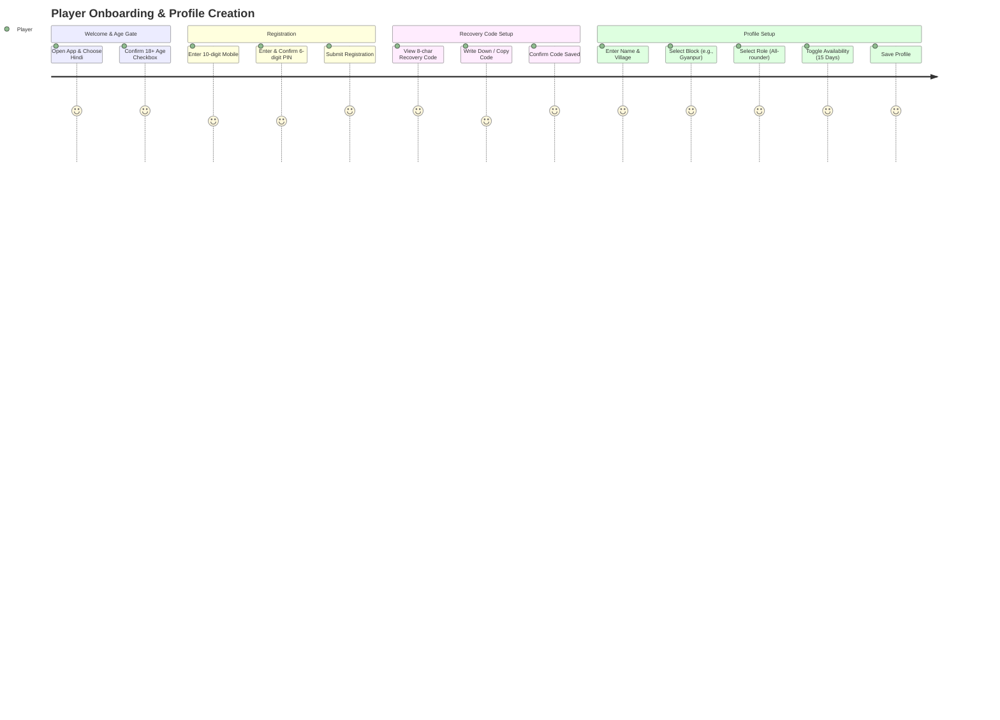
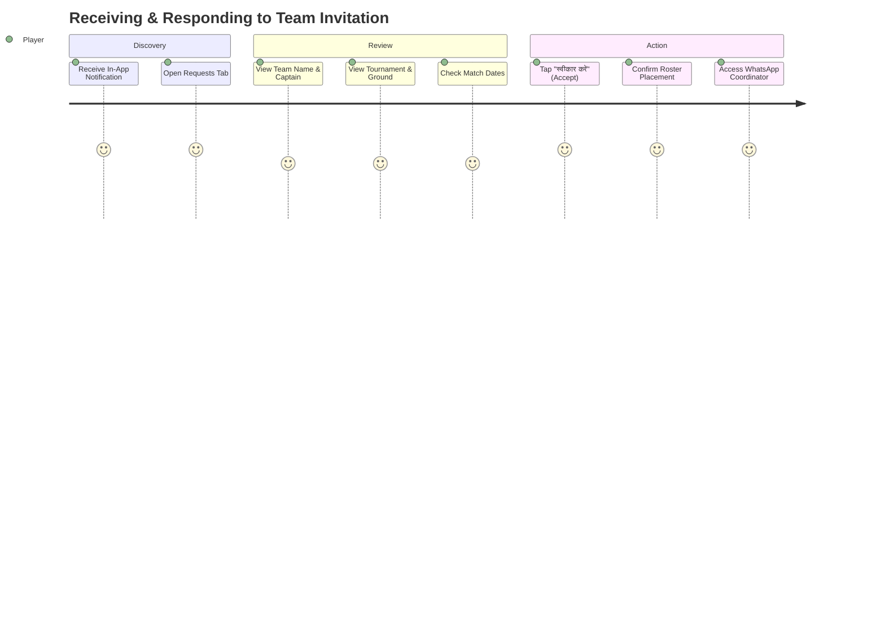
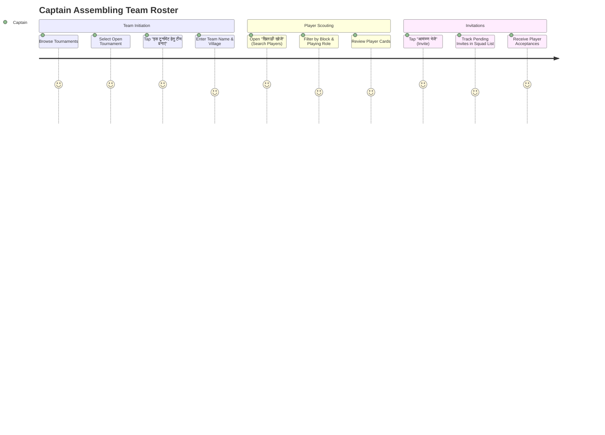
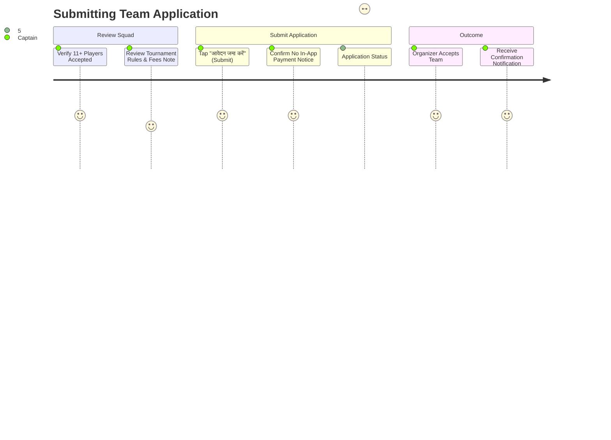
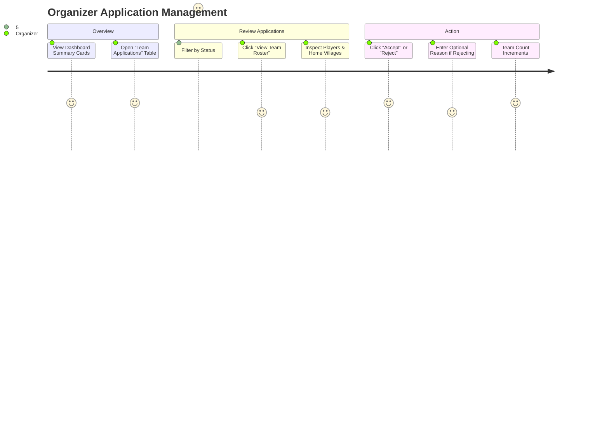
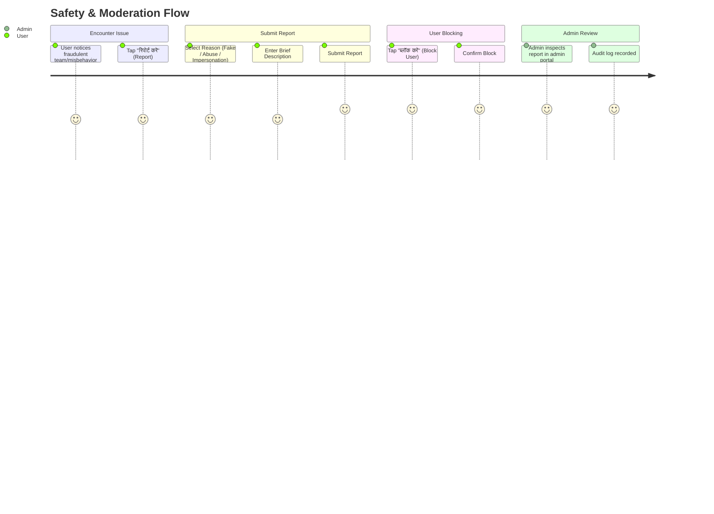
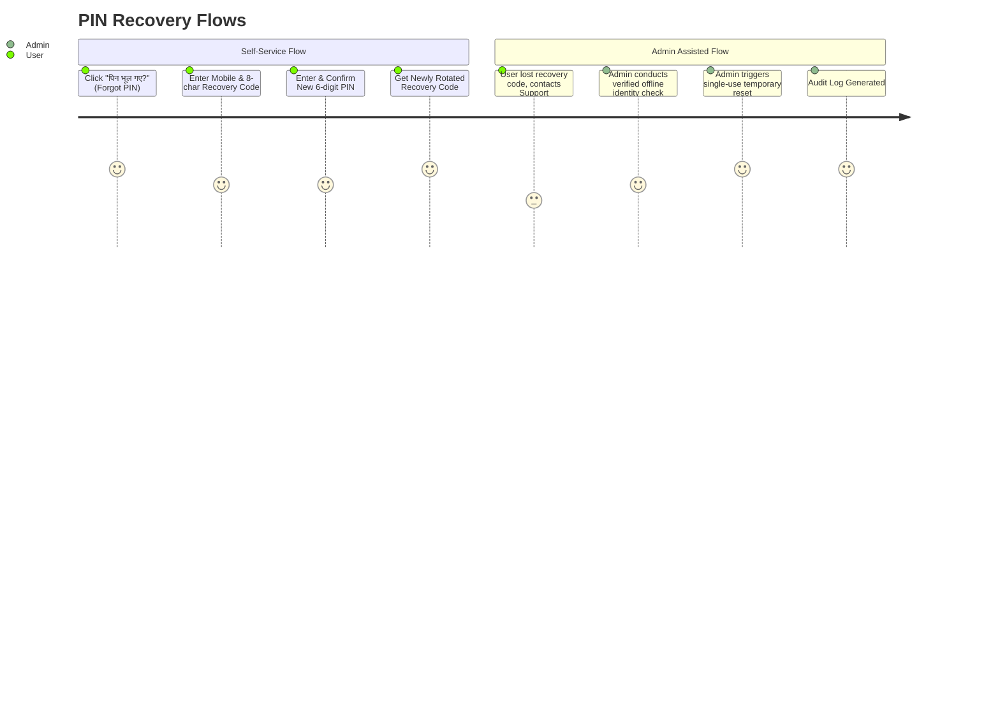

# User Journeys: Bhadohi Village Cricket Platform

**Document Status:** Approved Baseline v1  
**Project:** Bhadohi Village Cricket Platform (`bvcp`)  

---

## Journey 1: Local Player Onboarding & Profile Setup



### Steps & State Flow
1. **Welcome Screen:** User launches the app. Default language is Hindi. User sees a clean greeting card with cricket graphic and a brief explanation of the platform.
2. **Age Gate:** User checks mandatory checkbox: *"मैं प्रमाणित करता/करती हूँ कि मेरी आयु 18 वर्ष या उससे अधिक है।"* Next button activates only upon check.
3. **Registration Screen:** User enters 10-digit mobile number and chooses a 6-digit numeric PIN. Enters PIN again in confirmation field. Taps "पंजीकरण करें" (Register).
4. **Recovery Code Display Screen (Crucial):** System displays: `BK92-M48Z` with a prominent warning: *"यह आपका रिकवरी कोड है। इसे किसी सुरक्षित डायरी में लिख लें। पिन भूलने पर यह आवश्यक होगा।"* User clicks checkbox: *"मैंने कोड नोट कर लिया है"* and taps "आगे बढ़ें" (Proceed).
5. **Profile Form:** User enters Full Name, selects Village, chooses Development Block from dropdown (Gyanpur, Aurai, Bhadohi, Suriyawan, Deegh, Abholi), picks Primary Role (Batsman, Bowler, All-rounder, Wicketkeeper), and Batting/Bowling styles.
6. **Availability Setup:** User toggles "टूर्नामेंट के लिए उपलब्ध हूँ", selects validity duration (15 days), and toggles WhatsApp contact permission.
7. **Destination:** Lands on **Player Home Screen** showing open tournaments in their block and nearby villages.

---

## Journey 2: Player Receiving Team Invitation & Roster Confirmation



### Steps & State Flow
1. **Notification Received:** Player sees a badge on the mobile app "Requests" tab: *"ज्ञानपुर लायंस के कैप्टन रमेश ने आपको 'औराई प्रीमियर लीग' हेतु आमंत्रित किया है।"*
2. **Review Invitation Details:** Player opens the invitation. Card clearly displays:
   - Team Name: ज्ञानपुर लायंस (Gyanpur Lions)
   - Captain Name: रमेश कुमार (Ramesh Kumar)
   - Tournament: औराई प्रीमियर लीग 2026 (Aurai Premier League 2026)
   - Ground: मिर्जापुर रोड मैदान, औराई (Mirzapur Road Ground, Aurai)
   - Dates: 15 अक्टूबर - 20 अक्टूबर 2026
3. **Explicit Disclaimer:** Card displays the disclaimer: *"कृपया ध्यान दें: इस आमंत्रण को स्वीकार करने से आप इस टीम की सूची में शामिल होते हैं। अंतिम मैच एकादश (Playing XI), यात्रा और भोजन की व्यवस्था कैप्टन के साथ ऑफलाइन तय की जाएगी।"*
4. **Action Choice:**
   - **Accept ("स्वीकार करें"):** Status transitions to `ACCEPTED`. Captain receives in-app notification. Player is added to Team Roster.
   - **Decline ("अस्वीकार करें"):** Status transitions to `DECLINED`. Invitation is archived. Captain is notified.
5. **Post-Acceptance:** Once accepted, a "व्हाट्सएप पर कैप्टन से बात करें" button appears, opening a direct WhatsApp chat with the captain.

---

## Journey 3: Captain Creating Temporary Team & Assembling Roster



### Steps & State Flow
1. **Initiate Team:** Captain views open tournament details and taps "इस टूर्नामेंट हेतु टीम बनाएं" (Create Team for this Tournament).
2. **Team Basic Details:** Enters Team Name (e.g., "भदोही टाइगर्स") and Home Village. System creates a temporary team record linked specifically to that tournament. Captain is automatically placed as Squad Member #1 (Captain).
3. **Player Search:** Captain taps "खिलाड़ी जोड़ें" (Add Players). Filter bar allows filtering by:
   - Development Block (e.g., "औराई" / "ज्ञानपुर")
   - Playing Role ("गेंदबाज" / "ऑलराउंडर")
   - Availability ("वर्तमान में उपलब्ध")
4. **Send Invitations:** Captain taps "आमंत्रण भेजें" on desired player cards. System validates that the player has not blocked the captain and that squad capacity is not exceeded.
5. **Roster Monitoring:** Team details screen groups players into:
   - *स्वीकृत खिलाड़ी (Accepted)* - e.g., 8/15
   - *लंबित आमंत्रण (Pending Invitations)* - e.g., 4/15
   - *अस्वीकृत (Declined)* - e.g., 1
6. **Readiness Check:** When minimum required squad size is reached (e.g., 11 players), the "टूर्नामेंट में आवेदन करें" (Submit Application) button lights up.

---

## Journey 4: Captain Submitting Team Application to Tournament



### Steps & State Flow
1. **Verification:** Captain confirms the temporary team roster meets tournament squad limits.
2. **Review Terms:** Modal displays:
   - Entry Fee Note: "₹600 (मैदान पर आयोजक को देय)"
   - Match Format: 12 ओवर (Cosco गेंद)
   - Mandatory Disclaimer: *"इस ऐप पर कोई प्रवेश शुल्क नहीं लिया जाता है। टीम का चयन आयोजक की स्वीकृति पर निर्भर करता है।"*
3. **Submit:** Captain taps "आवेदन की पुष्टि करें" (Confirm Application).
4. **Duplicate Safeguard:** Server confirms no prior application exists from this captain/team for this tournament.
5. **Pending State:** Status shows "लंबित - आयोजक समीक्षा कर रहे हैं" (Pending - Under Review).
6. **Result Notification:** When organizer approves, captain receives in-app alert: *"बधाई हो! आपकी टीम 'भदोhi टाइगर्स' को 'औराई कप 2026' में शामिल कर लिया गया है।"*

---

## Journey 5: Organizer Creating & Publishing Tournament (Desktop Web)

```mermaid
journey
    title Organizer Tournament Publishing Wizard
    section Step 1: Basic Info
      Enter Name & Location: 5: Organizer
      Select Block & Dates: 5: Organizer
    section Step 2: Registration
      Set Reg Open/Close Dates: 5: Organizer
      Set Max Teams & Ball Type: 5: Organizer
      Add Fee Notice (Plain Text): 4: Organizer
    section Step 3: Rules & Disclaimer
      Define Age & Regional Rules: 4: Organizer
      Confirm Offline Disclaimer: 5: Organizer
    section Step 4: Review & Publish
      Preview Mobile & Share View: 5: Organizer
      Publish Tournament: 5: Organizer
      Generate WhatsApp Share Link: 5: Organizer
```

### Steps & State Flow
1. **Step 1 (Basic Details):** Organizer enters Tournament Title ("भदोही ग्रामीण क्रिकेट महाकुंभ"), Ground Location ("इंटर कॉलेज मैदान, ज्ञानपुर"), Block ("ज्ञानपुर"), Start Date, and End Date.
2. **Step 2 (Registration Details):** Sets Registration Open/Close dates, Max Teams (16), Squad Size (11-15), Match Format (10 Overs Tennis Ball), and Informational Fee Note ("₹500 प्रति टीम - नकद मैदान पर").
3. **Step 3 (Rules & Disclaimers):** Enters team qualification rules, required documents (e.g. Aadhar card for 18+ proof at ground), and confirms standard platform disclaimer regarding offline operations.
4. **Step 4 (Review & Publish):** Desktop displays an interactive live preview of how the tournament card renders on mobile devices. Organizer clicks "प्रकाशित करें" (Publish) or "ड्राफ्ट सहेजें" (Save Draft).
5. **Distribution:** Upon publishing, system generates a one-click WhatsApp broadcast card with link.

---

## Journey 6: Organizer Managing Applications on Desktop Dashboard



### Steps & State Flow
1. **Dashboard Overview:** Organizer sees:
   - कुल प्राप्त आवेदन (Total Applications): 22
   - स्वीकृत टीमें (Accepted Teams): 12 / 16
   - लंबित आवेदन (Pending): 8
   - अस्वीकृत (Rejected): 2
2. **Tabular Inspection:** Organizer views rows with Team Name, Home Village, Captain Name, Squad Size, and Submission Date.
3. **Roster Drawer:** Clicking "रोस्टर देखें" slides open a side panel showing the players in the squad and their verified 18+ status.
4. **Approval Action:**
   - **Accept:** Status changes to `ACCEPTED`. Team count updates. Push/in-app alert sent to captain.
   - **Reject:** Organizer inputs short reason (e.g., "कोटा पूरा हो गया है" / "Quota full" or "स्थानीय निवास नियम"). Status changes to `REJECTED`. Captain notified.

---

## Journey 7: Safety, Reporting & User Blocking



### Steps & State Flow
1. **Initiate Report:** User encounters inappropriate content on a team card or receives unwanted invitations. Clicks "रिपोर्ट करें".
2. **Category Selection:** User selects one of:
   - गलत/फ़र्ज़ी जानकारी (Fake / Inaccurate Information)
   - दुर्व्यवहार या अनुचित भाषा (Abusive / Inappropriate Behavior)
   - आयु सीमा उल्लंघन (Suspected Under-18 Participant)
   - अन्य (Other)
3. **Submit Report:** User enters up to 250 characters of description. Report is saved in `Report` table with timestamp and reporter ID.
4. **Immediate Blocking:** User is offered option: *"क्या आप इस उपयोगकर्ता को ब्लॉक भी करना चाहते हैं?"*. Confirming adds record to `Block` table. Blocked user can never find, invite, or message the reporter.
5. **Admin Action:** Administrator audits reported queue. If abuse is validated, admin triggers account suspension. Suspension generates an immutable `AuditLog` entry.

---

## Journey 8: Account PIN Recovery (Self-Service & Admin Assisted)



### Steps & State Flow
1. **Self-Service Initiation:** User taps "पिन भूल गए?" on Login screen.
2. **Credentials Input:** User enters their 10-digit mobile number and the 8-character plaintext recovery code (`XXXX-XXXX`) received during registration.
3. **Validation & Rotation:**
   - Server hashes the entered recovery code and compares against stored hash.
   - If matched: User sets a new 6-digit PIN.
   - Old recovery code is invalidated.
   - Server securely generates and presents a **new** recovery code.
4. **Admin-Assisted Fallback:** If user has lost both PIN and recovery code, they must submit a support request. Admin verifies physical identity in Bhadohi. Admin triggers a one-time reset via Admin Portal. Action creates an immutable entry in `AuditLog`.
