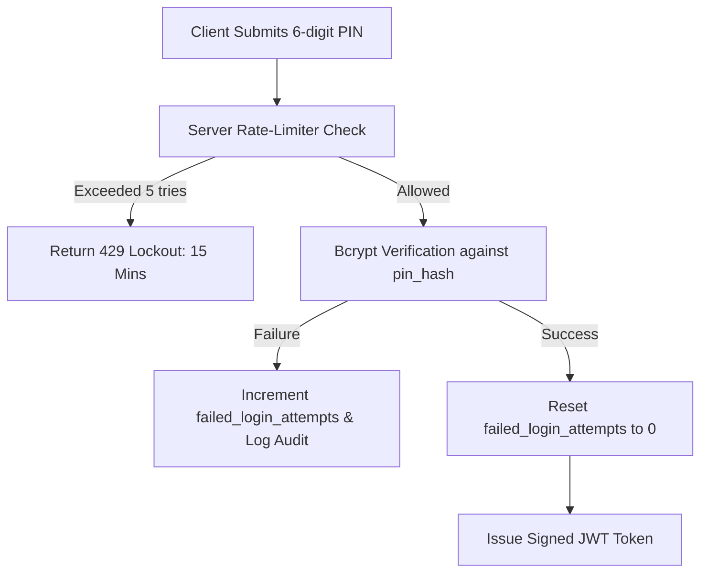

# Security and Privacy Architecture

**Document Status:** Approved Baseline v1  
**Project:** Bhadohi Village Cricket Platform (`bvcp`)  
**Security Mandate:** Zero Plaintext Credential Exposure, Strict Confidentiality of Mobile Numbers, and Server-Enforced Boundaries.

---

## 1. Authentication Security Architecture

### 1.1 PIN Cryptographic Storage
- **Algorithm:** `bcrypt` with cost factor 12 or `Argon2id` (memory 64MB, iterations 3).
- **Prohibition:** No custom hashing algorithms. MD5, SHA1, and unsalted SHA256 are strictly forbidden.
- **Logging Rule:** All request loggers (Morgan, Winston, etc.) must have sanitization filters explicitly stripping `pin`, `confirm_pin`, `recovery_code`, and `Authorization` headers.

### 1.2 Recovery Code Architecture
- **Format:** 8 alphanumeric characters formatted as `XXXX-XXXX` (using unambiguous alphabet: `23456789ABCDEFGHJKLMNPQRSTUVWXYZ`).
- **Generation:** Cryptographically secure pseudorandom number generator (`crypto.randomBytes`).
- **Storage:** Hashed via `bcrypt` immediately upon generation. Plaintext is sent in the response once during registration and never persisted.
- **Single-Use Invalidation:** Upon successful PIN recovery, the current recovery code hash is invalidated, and a newly generated code is created and displayed.

### 1.3 Brute-Force & Lockout Controls
- **Tracking:** Stored in `failed_login_attempts` column and cached in Redis/memory.
- **Threshold:** 5 consecutive failures within a 15-minute sliding window locks the account (`locked_until = NOW() + INTERVAL '15 minutes'`).
- **Escalation:** Subsequent failures after unlock escalate the lockout to 60 minutes.

---

## 2. Privacy & Data Protection Rules

### 2.1 Mobile Number Confidentiality
1. **Login Identifier Only:** The 10-digit mobile number functions solely as a unique login identifier. It does not constitute official identity proof.
2. **Zero Public Exposure:** The mobile number must **never** appear in:
   - Public player search results (`GET /api/v1/players`)
   - Public tournament listings (`GET /api/v1/tournaments`)
   - Public team rosters (`GET /api/v1/teams/:id`)
   - Error messages or server stack traces
3. **Contact Facilitation via WhatsApp:**
   - Captains can contact players only if the player has accepted a roster invitation and enabled `allow_whatsapp_contact`.
   - The app constructs a client-side intent URL (`https://wa.me/91XXXXXXXXXX?text=...`) directly on the device, rather than publishing the raw phone number in directory pages.

### 2.2 Account Deletion & Right-to-be-Forgotten
- Users can delete their account from the Settings screen.
- Deletion requires entering the current 6-digit PIN.
- Execution steps:
  1. Immediately set `is_available = FALSE` in `player_profiles`.
  2. Set `is_active = FALSE` in `users`.
  3. Strip personal names and village data (`full_name = 'भूतपूर्व खिलाड़ी'`, `village = '---'`).
  4. Anonymize past team member associations.
  5. Invalidate all active session tokens.

---

## 3. Server-Side Authorization & Input Sanitization

1. **Authorization Middleware:**
   - Every protected API route validates the bearer token via JWT signature check.
   - Resource access validates explicit ownership (`team.captain_user_id == req.user.id`, `tournament.organizer_user_id == req.user.id`).
2. **SQL Injection Defense:**
   - All queries use parameterized SQL prepared statements or a hardened ORM/Query Builder (e.g. Prisma or Kysely). Raw string concatenation in SQL queries is prohibited.
3. **HTTP Hardening:**
   - Standard security headers enforced via `helmet`:
     - `Content-Security-Policy (CSP)`
     - `X-Frame-Options: DENY`
     - `X-Content-Type-Options: nosniff`
     - `Strict-Transport-Security (HSTS)`
   - Cross-Origin Resource Sharing (`CORS`) whitelist restricting web origins.
4. **Audit Logging:**
   - Sensitive administrative operations (account unlock, user suspension, PIN reset assistance, tournament cancellation) must write an immutable audit entry to `audit_logs`.
