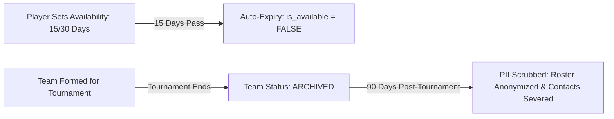

# Data Expiry, Retention & Archival Strategy

**Document Status:** Approved Baseline v1  
**Project:** Bhadohi Village Cricket Platform (`bvcp`)  
**Core Policy:** Ephemeral Teams, Timed Availability, and Automated 90-Day PII Scrubbing.

---

## 1. Lifecycle Overview



Village cricket is dynamic and seasonal. Retaining stale availability creates frustration for captains, while indefinitely publishing old rosters exposes village players to data harvesting. The platform therefore enforces strict automatic expiration and anonymization.

---

## 2. Automated Expiry Job Engine (`ExpiryJob`)

A daily automated scheduler (running at 02:00 AM IST / 20:30 UTC) executes four distinct archival and cleanup routines. Every execution is audited in the `expiry_jobs` table.

### 2.1 Job 1: Player Availability Invalidation (`AVAILABILITY_EXPIRY`)
* **Trigger:** Daily at 02:00 AM IST.
* **Logic:**
  ```sql
  UPDATE player_profiles
  SET is_available = FALSE,
      updated_at = CURRENT_TIMESTAMP
  WHERE is_available = TRUE 
    AND availability_expires_at <= CURRENT_TIMESTAMP;
  ```
* **User Notification:** Generates an in-app notice to the player: *"आपकी खेलने की उपलब्धता समाप्त हो गई है। यदि आप आगामी मैचों के लिए तैयार हैं, तो प्रोफ़ाइल में जाकर 'उपलब्ध हूँ' पर टैप करें।"*
* **Impact:** Prevents captains from contacting players who are busy with farming, work, or exams.

### 2.2 Job 2: Invitation Timeout (`INVITATION_EXPIRY`)
* **Trigger:** Daily or triggered upon tournament registration closure.
* **Logic:**
  ```sql
  UPDATE player_invitations
  SET status = 'EXPIRED'
  WHERE status = 'PENDING'
    AND (
      expires_at <= CURRENT_TIMESTAMP 
      OR tournament_id IN (
        SELECT id FROM tournaments 
        WHERE status IN ('REGISTRATION_CLOSED', 'CANCELLED', 'COMPLETED')
      )
    );
  ```
* **Impact:** Cleans up clogged captain rosters and clears pending badges from player request tabs.

### 2.3 Job 3: Post-Tournament Team Archival (`TOURNAMENT_ARCHIVAL`)
* **Trigger:** Daily.
* **Logic:**
  - Evaluates tournaments where `status = 'COMPLETED'` or `CURRENT_DATE > end_date + INTERVAL '7 days'`.
  - Sets `teams.status = 'ARCHIVED'` for all teams bound to those tournaments.
* **Impact:** Locks team rosters from any further edits, player additions, or removals.

### 2.4 Job 4: 90-Day Post-Tournament PII Scrubbing (`PII_SCRUBBING`)
* **Trigger:** Daily.
* **Logic:**
  - Identifies tournaments completed more than 90 calendar days ago.
  - Anonymizes public roster relationships in `team_members` so historical team rosters do not expose full player identities.
  - Completely severs WhatsApp coordinator redirect links for those squads.
  - Purges temporary draft teams that were never submitted to an application.
* **Preservation Rule:** The `PlayerProfile` itself remains active and linked to the `User` account, so players do not lose their login credentials or base profile for future tournament seasons.

---

## 3. Data Retention Summary Matrix

| Data Entity | Retention Duration | Post-Retention Action | User Impact |
|---|---|---|---|
| **User Account & PIN** | Active until user deletion request | Hashed credentials preserved | User can log in anytime |
| **Player Profile** | Active until user deletion request | Preserved | Readily available for next tournament |
| **Availability Status** | 15 or 30 days from toggle | Flipped to `is_available = FALSE` | Excluded from captain search |
| **Player Invitations** | 5 days or reg. close date | Status marked `EXPIRED` | Removed from active requests |
| **Temporary Team Roster** | Active during tournament | Status marked `ARCHIVED` | Read-only view |
| **Public Roster / Contacts** | 90 days post-tournament | Anonymized & contacts deleted | No permanent public history |
| **Audit Logs** | 365 days | Archived to cold storage | Compliance & incident review |
| **Moderation Reports** | 180 days | Archived / purged | Internal admin record |

---

## 4. Expiry Failure Safeguards

If an automated scheduled run encounters an exception or fails:
1. The error details and stack trace are logged to `expiry_jobs.error_details`.
2. The job status is recorded as `FAILED`.
3. An administrative alert is generated for immediate platform admin inspection.
4. Read queries apply a fallback filter: `WHERE is_available = TRUE AND availability_expires_at > CURRENT_TIMESTAMP`, ensuring expired records are never presented in search results even if the batch job is temporarily delayed.
