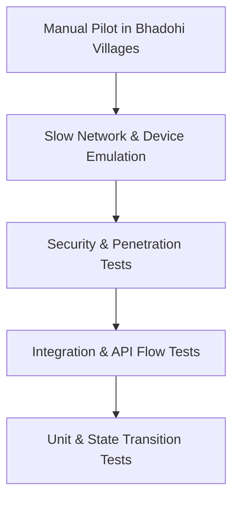

# Quality Assurance & Test Strategy

**Document Status:** Approved Baseline v1  
**Project:** Bhadohi Village Cricket Platform (`bvcp`)  
**Testing Philosophy:** Multi-layered verification ensuring zero security vulnerabilities, accurate Hindi rendering, and graceful degradation on rural networks.

---

## 1. Testing Pyramid & Target Coverage

- **Target Unit Test Coverage:** >= 85% on core domain logic, security routines, and status transitions.
- **Target Integration Coverage:** 100% on core user journeys (Registration, Team Formation, Tournament Application, Expiry).

---

## 2. Unit Testing Suite

### 2.1 Domain & Validation Tests
- **Mobile Number Validation:** Validates strictly 10 Indian digits starting with 6, 7, 8, or 9 (`/^[6-9]\d{9}$/`). Rejects non-digits, country codes (`+91`), and malformed inputs.
- **PIN Cryptographic Hash:** Verifies `bcrypt` or `Argon2id` produces valid hash with salt factor 12. Validates negative match on 1-digit difference.
- **Recovery Code Generation:** Verifies 8-character token uses unambiguous character alphabet and passes format regex (`/^[2-9A-HJ-NP-Z]{4}-[2-9A-HJ-NP-Z]{4}$/`).
- **Date Sequencing:** Validates that `registration_close_date <= start_date` and `start_date <= end_date`.
- **Squad Capacity:** Verifies that attempting to add a 16th member when `max_squad_size = 15` throws `SquadCapacityExceededException`.

### 2.2 State Transition Matrix Tests
- **Tournament Lifecycle:** Tests all permitted state transitions (`DRAFT` -> `PUBLISHED` -> `REGISTRATION_CLOSED` -> `COMPLETED`). Confirms illegal transitions throw an error (e.g. `COMPLETED` -> `DRAFT`).
- **Application Statuses:** Validates that an application cannot be accepted once tournament registration is closed.
- **Invitation Statuses:** Validates that a declined or expired invitation cannot be accepted.

---

## 3. Integration Testing Suite

### 3.1 Authentication & Brute-Force Defense
- **Registration Flow:** Submits valid mobile + PIN + age confirmation -> asserts user created, recovery code returned in response, and no plaintext code stored in DB.
- **Failed PIN Lockout:** Simulates 5 consecutive incorrect PIN inputs -> verifies 5th attempt returns `429 Too Many Requests` with a 15-minute lockout timestamp. Confirms 6th attempt is rejected immediately without DB hash calculation.
- **PIN Recovery Flow:** Submits mobile + recovery code -> verifies new PIN is set, old recovery code is rejected on second attempt, and new recovery code functions.

### 3.2 Tournament & Team Orchestration
- **Full Application Flow:**
  1. Organizer creates and publishes a tournament.
  2. Captain creates a team and sends invitations to 11 players.
  3. Players accept invitations.
  4. Captain submits tournament application.
  5. Organizer accepts application via dashboard.
  6. Assert team status updates to `ACCEPTED` and all relevant in-app notifications are emitted.
- **Duplicate Application Prevention:** Captain attempts to submit the same team a second time -> server returns `409 Conflict`.
- **Cancellation Cascade:** Organizer cancels tournament with reason -> confirms all pending applications marked `REJECTED`, invitations expired, and notification sent.

---

## 4. Security & Negative Testing Suite

| Test ID | Test Scenario | Expected Outcome |
|---|---|---|
| **SEC-01** | User A attempts `PUT /api/v1/profiles/me` with User B's token | Server rejects with `403 Forbidden` / updates only User A. |
| **SEC-02** | Captain A attempts to remove a player from Captain B's team | Server returns `403 Forbidden` with ownership error. |
| **SEC-03** | Organizer A attempts to accept an application for Organizer B's tournament | Server returns `403 Forbidden`. |
| **SEC-04** | User attempts `POST /api/v1/admin/users/:id/reset-pin` without `ADMIN` role | Server returns `403 Forbidden` and logs security warning. |
| **SEC-05** | Public call to `GET /api/v1/players` | Returns profile details with `mobile_number` completely omitted. |
| **SEC-06** | Inspect server log files after 1,000 registrations and logins | Confirms zero plaintext PINs or recovery codes in logs. |
| **SEC-07** | User submits 6 reports within 24 hours | 6th report returns `429 Too Many Requests` (Daily report quota exceeded). |
| **SEC-08** | Blocked User B attempts to search or invite User A | User A does not appear in search results; invite returns `404 Not Found`. |

---

## 5. Slow-Network & Device Emulation Tests

- **Rural 3G Emulation:** Network throttled to 200 kbps download, 50 kbps upload, 400ms RTT.
  - Verifies screen skeleton loaders display instantly.
  - Verifies no UI hangs or white-screens occur.
  - Verifies tap retry mechanisms successfully resume interrupted actions without duplicate submissions.
- **Small Screen Responsiveness:** Verified on 4.5" to 6.5" Android viewports (320dp - 411dp width).
  - Ensures Hindi Devanagari text labels do not truncate abruptly.
  - Ensures touch targets remain >= 48dp.
- **Hindi Typography & Orthography:**
  - Verified rendering of Devanagari ligatures (संयुक्त अक्षर like 'प्रतियोगिता', 'स्वीकार', 'ऑलराउंडर') with `Noto Sans Devanagari`.
