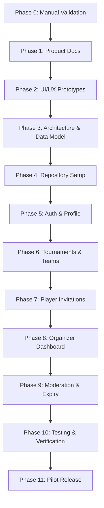

# Phased Delivery Plan & Complexity Estimation

**Document Status:** Approved Baseline v1  
**Project:** Bhadohi Village Cricket Platform (`bvcp`)  
**Delivery Framework:** Strict Phase-Gate Model. No phase begins without explicit human approval.

---

## 1. Master Phase Roadmap & Complexity Summary

| Phase | Phase Name | Complexity | Estimated Effort | Key Deliverable | Phase-Gate Exit Criterion |
|---|---|:---:|:---:|---|---|
| **Phase 0** | Manual Validation | Low | 1-2 Weeks | Field trial data from Bhadohi | 50 players, 10 teams, 3 organizers trialed offline |
| **Phase 1** | Product Documentation | Medium | 3-4 Days | 17 Complete Specification Docs | Full documentation suite created & reviewed |
| **Phase 2** | UI/UX Prototypes | Medium | 4-5 Days | Interactive Hindi Mockups | Mobile 25 screens & desktop views verified |
| **Phase 3** | Architecture & Schema | Medium | 3-4 Days | ADR, DDL Schemas, API Contract | Database migrations & contracts validated |
| **Phase 4** | Repository Setup | Low | 2 Days | Monorepo structure, Lints, CI | Clean build, linters passing, test harnesses ready |
| **Phase 5** | Auth & Profile Engine | High | 4-5 Days | PIN auth, Bcrypt, Profile CRUD | Zero-OTP PIN flow + rate-limiting tested |
| **Phase 6** | Tournaments & Teams | High | 5-6 Days | Tournament & Team Services | Creation, listing, applications functional |
| **Phase 7** | Player Invitations | Medium | 4-5 Days | Invite workflow & Requests tab | Invite lifecycle (Accept/Decline) verified |
| **Phase 8** | Organizer Web Dashboard | High | 5-6 Days | Next.js Data Tables & Wizard | Responsive desktop operations operational |
| **Phase 9** | Moderation & Expiry | High | 4-5 Days | Report, Block, Cron Expiry Engine | Nightly archival & safety queues working |
| **Phase 10** | Comprehensive Testing | High | 5-6 Days | Security, Negative, 3G Tests | 100% core coverage, zero leaks, security clean |
| **Phase 11** | Staging & Village Pilot | Medium | 2 Weeks | Controlled Pilot in Bhadohi | Real tournament executed with zero critical defects |

---

## 2. Detailed Phase Specifications

### Phase 0: Manual Bhadohi Validation
- **Objective:** Validate real-world demand and offline workflows with local organizers, captains, and players in Bhadohi before writing software.
- **Activities:** Run tournament notices on printed sheets and manual WhatsApp forwards; record friction points.
- **Target:** Validate 50 players, 10 teams, 3 organizers, 2 completed tournaments.

### Phase 1: Product Documentation (CURRENT PHASE)
- **Objective:** Formulate complete, unambiguous specifications across 17 mandatory documents.
- **Deliverables:** `docs/00` to `docs/16` covering requirements, data models, UX states, security, retention, and risks.
- **Gate:** Human approval of Master Documentation Plan.

### Phase 2: UI/UX Prototypes
- **Objective:** Create visual prototypes for all 25 mobile screens and desktop dashboard.
- **Deliverables:** High-fidelity interactive layouts adhering to `#1E7A4C` / `#123B2A` / `#F6F8F3` visual palette with authentic Hindi typography.
- **Gate:** Verification of touch targets (>= 48dp), font legibility, and all 6 UI states (loading, empty, error, permission, expired, cancelled).

### Phase 3: Architecture and Data Model
- **Objective:** Establish the formal database schema, API contracts, and authorization architecture.
- **Deliverables:** PostgreSQL migration files, Prisma/Kysely schemas, REST route definitions, ADR-001.
- **Gate:** Schema review confirming complete absence of scoring/ranking entities.

### Phase 4: Repository Setup
- **Objective:** Initialize the project repository with tooling, linting, formatting, and CI checks.
- **Deliverables:** Monorepo directory structure, environment variables configuration (`.env.example`), Flutter SDK setup, Node.js backend workspace, GitHub Actions CI workflow.
- **Gate:** Automated linting, type-checking, and base test suites passing.

### Phase 5: Authentication & Profile Engine
- **Objective:** Implement secure Mobile + 6-digit PIN authentication, recovery code generation, and player profiles.
- **Deliverables:** Backend auth routes, `bcrypt` password hashing, failed attempt rate-limiter, profile creation, and 15-day availability toggle.
- **Gate:** Negative security tests passing (brute force lockout, zero plaintext credentials in logs).

### Phase 6: Tournaments & Teams
- **Objective:** Implement tournament creation wizard, public tournament listing, and temporary team formation.
- **Deliverables:** Organizer tournament wizard backend/frontend, team creation bound to tournament, team application submission, and cancellation reason flow.
- **Gate:** End-to-end integration test of tournament creation -> team application.

### Phase 7: Player Invitations
- **Objective:** Build player scouting and roster invitation engine.
- **Deliverables:** Filtered player search, invitation dispatch, player Requests tab ("स्वीकार करें" / "अस्वीकार करें"), and WhatsApp coordinator handoff.
- **Gate:** Verification that non-accepted players cannot be added to playing rosters.

### Phase 8: Organizer Web Dashboard
- **Objective:** Deliver high-density desktop web portal for organizers.
- **Deliverables:** Next.js dashboard, operational summary cards, application review table with expandable roster drawer, announcement broadcaster.
- **Gate:** Keyboard navigation, table sorting/filtering, and responsive desktop layout verified.

### Phase 9: Moderation & Expiry Engine
- **Objective:** Enforce safety, user blocking, admin audit queues, and automated data retention jobs.
- **Deliverables:** Reporting endpoint, user block engine, admin moderation table, scheduled cron for 15-day availability expiry and 90-day PII scrubbing.
- **Gate:** Expiry job execution test validating data anonymization.

### Phase 10: Comprehensive Testing & Security Hardening
- **Objective:** Execute full verification across unit, integration, negative, security, and rural 3G network conditions.
- **Deliverables:** Automated test reports, slow-network emulation artifacts, OWASP API security scan report.
- **Gate:** 100% test pass rate on mandatory test scenarios (`docs/13-test-strategy.md`).

### Phase 11: Staging & Controlled Village Pilot
- **Objective:** Deploy staging environment and conduct real-world pilot in Bhadohi.
- **Deliverables:** Staging URL and test Android APK, user onboarding assistance, pilot bug-fix patches.
- **Gate:** Written human approval for production deployment.
