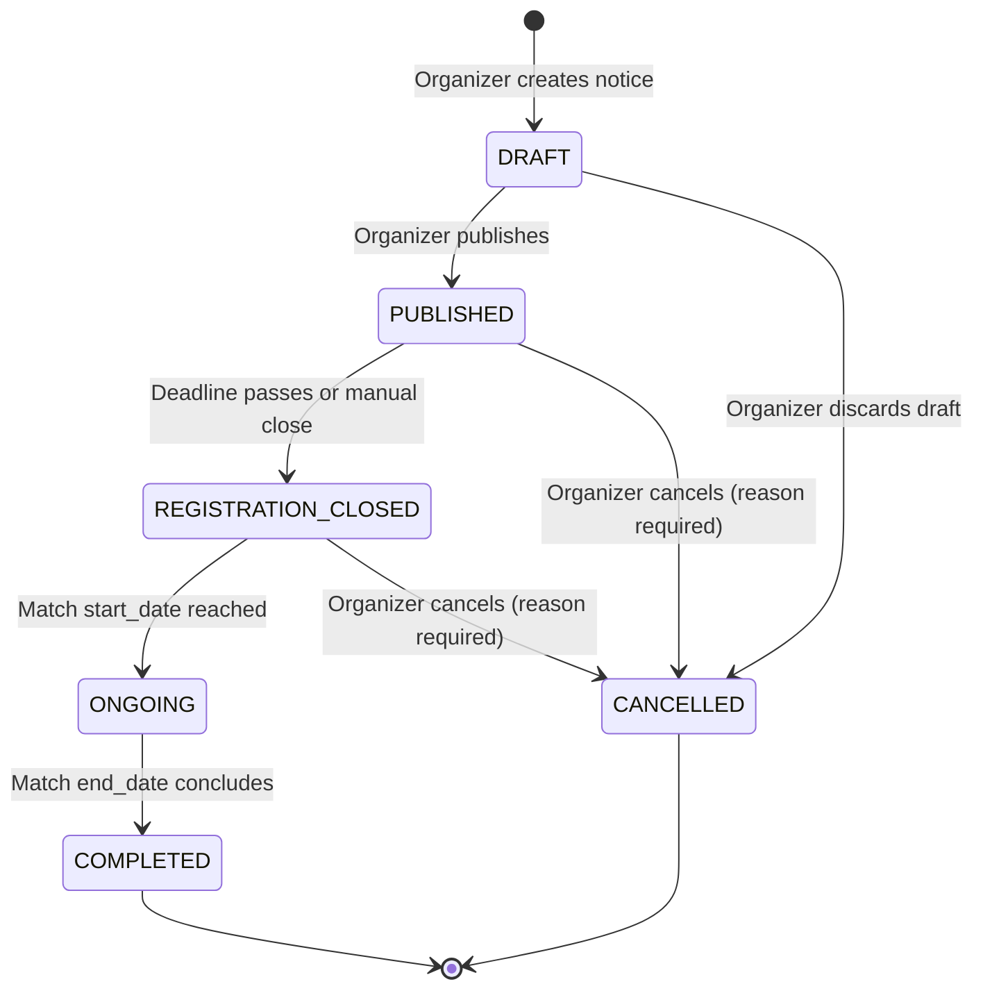
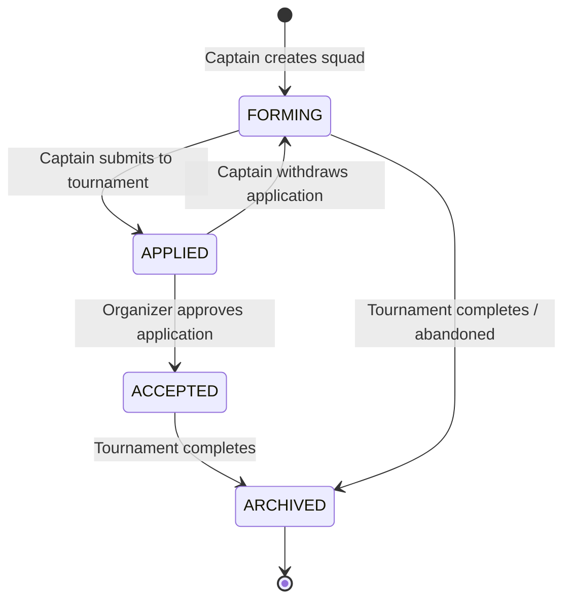
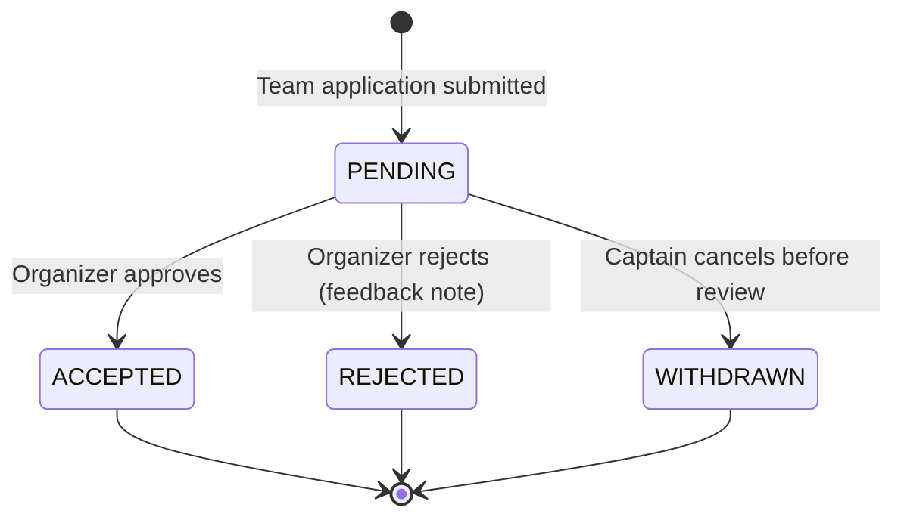
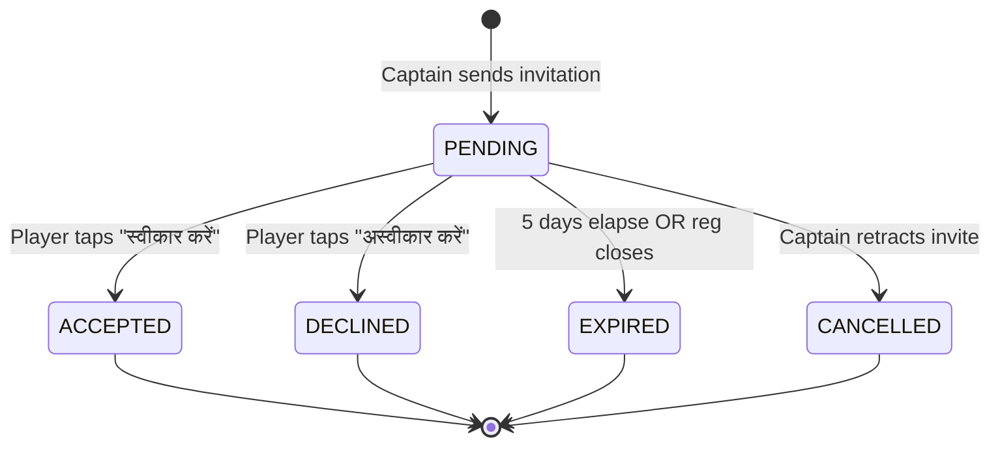
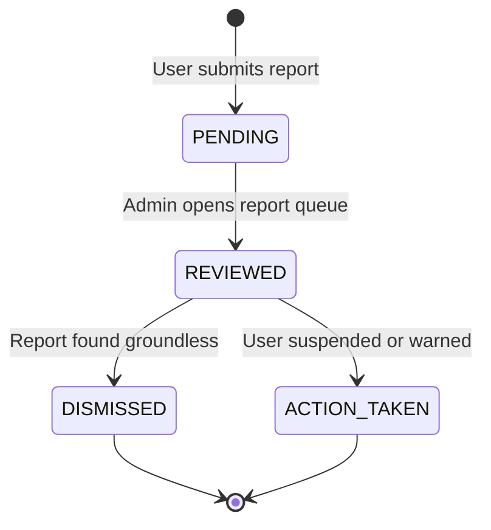

# Finite State Machines & State Transition Rules

**Document Status:** Approved Baseline v1  
**Project:** Bhadohi Village Cricket Platform (`bvcp`)  
**SDLC Phase:** Phase 3 (Architecture & Data Model)  
**Enforcement:** Server-Side Guard Middleware & Database CHECK Constraints  

---

## 1. Tournament State Machine (`TournamentStatus`)

### Transition Specifications:
| From State | To State | Trigger / Guard Condition | Side Effects |
|---|---|---|---|
| `DRAFT` | `PUBLISHED` | Organizer clicks "Publish". Guard: `registration_close_date <= start_date` AND `min_squad_size >= 11`. | Tournament becomes visible in public search and captain listings. |
| `PUBLISHED` | `REGISTRATION_CLOSED` | System cron detects `CURRENT_TIMESTAMP >= registration_close_date` OR organizer manually locks entries. | No new team applications can be submitted. Pending invitations expire. |
| `REGISTRATION_CLOSED` | `ONGOING` | `CURRENT_DATE >= start_date`. | Operational lock on team rosters. |
| `ONGOING` | `COMPLETED` | `CURRENT_DATE > end_date`. | Schedules teams for archival; starts 90-day PII scrub countdown. |
| `PUBLISHED` / `REG_CLOSED` | `CANCELLED` | Organizer enters mandatory cancellation reason (min 10 chars). | In-app alerts sent to all applied captains. All pending applications marked `REJECTED`. |

*Strictly Prohibited:* Any transition out of `COMPLETED` or `CANCELLED`.

---

## 2. Temporary Team State Machine (`TeamStatus`)

### Transition Specifications:
| From State | To State | Trigger / Guard Condition | Side Effects |
|---|---|---|---|
| `FORMING` | `APPLIED` | Captain clicks "Submit Application". Guard: Roster has at least `min_squad_size` accepted players. | Locks roster additions until organizer reviews. Creates `TournamentApplication`. |
| `APPLIED` | `ACCEPTED` | Organizer accepts application from desktop dashboard. | Team officially entered in tournament schedule. Captain notified. |
| `APPLIED` | `FORMING` | Captain withdraws application while `PENDING`. | Roster unlocked for edits or player replacements. |
| `ACCEPTED` | `ARCHIVED` | Tournament transitions to `COMPLETED` or 7 days post-end. | Roster is locked permanently. Contacts queued for 90-day scrubbing. |

---

## 3. Tournament Application State Machine (`ApplicationStatus`)

### Transition Specifications:
- `PENDING` -> `ACCEPTED`: Can only be triggered by the tournament organizer. Increments tournament accepted teams counter.
- `PENDING` -> `REJECTED`: Can only be triggered by the tournament organizer. Allows optional rejection reason. Captain notified.
- `PENDING` -> `WITHDRAWN`: Can only be triggered by the team captain.

---

## 4. Player Invitation State Machine (`InvitationStatus`)

### Transition Specifications:
- `PENDING` -> `ACCEPTED`: Creates entry in `team_members` with status `CONFIRMED`. Unlocks WhatsApp contact button for captain.
- `PENDING` -> `DECLINED`: Marks invitation archived. Captain notified.
- `PENDING` -> `EXPIRED`: Nightly cron or registration close trigger.
- `PENDING` -> `CANCELLED`: Captain retracts invitation before player response.

---

## 5. Safety Report State Machine (`ReportStatus`)

- Every transition to `ACTION_TAKEN` generates an immutable entry in `audit_logs`.
- If an account is suspended, `users.is_active` is set to `FALSE` immediately terminating all active sessions.
