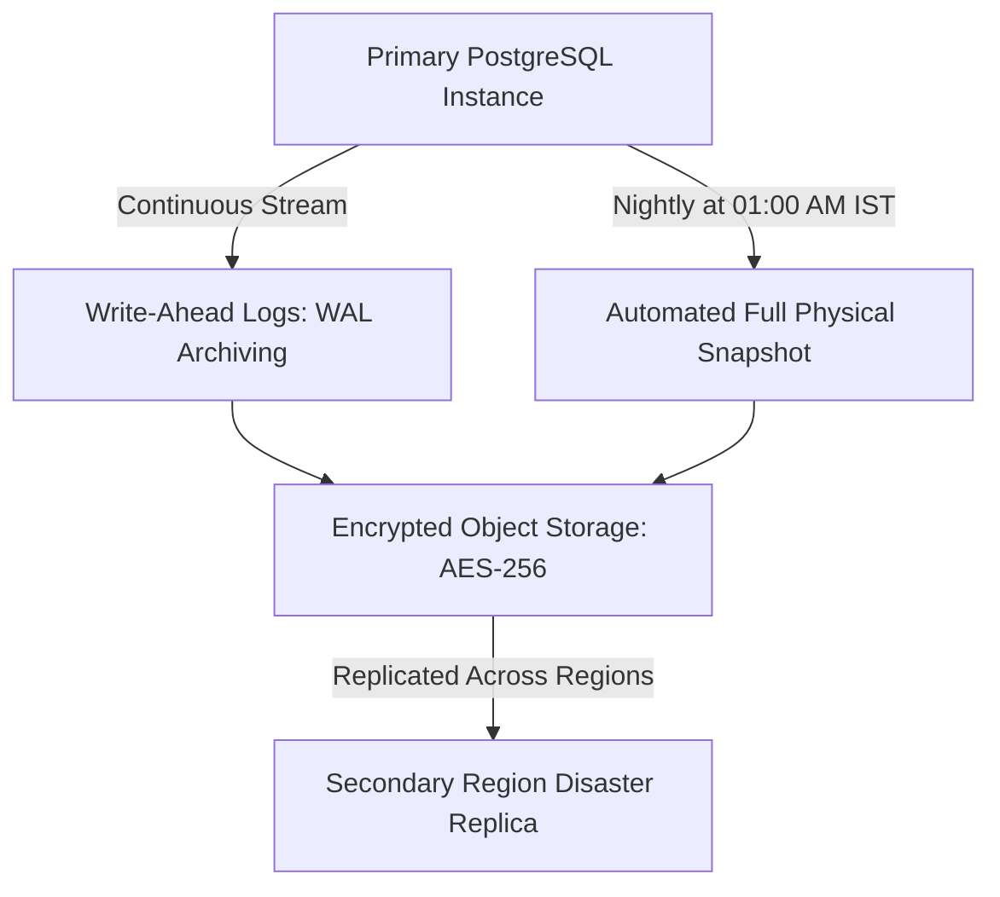

# Backup, Disaster Recovery & High Availability Plan

**Document Status:** Approved Baseline v1  
**Project:** Bhadohi Village Cricket Platform (`bvcp`)  
**SDLC Phase:** Phase 3 (Architecture & Data Model)  
**Database Target:** Managed PostgreSQL 15+  

---

## 1. Objectives & Recovery Targets

| Metric | Target | Rationale |
|---|---|---|
| **Recovery Point Objective (RPO)** | **< 15 Minutes** | Maximum permissible data loss in catastrophic disaster. Covered by Continuous WAL Archiving. |
| **Recovery Time Objective (RTO)** | **< 60 Minutes** | Maximum permissible duration to restore full platform availability following infrastructure outage. |
| **Backup Retention Window** | **30 Days** | Retain daily automated snapshots for 30 days; monthly historical archives for 1 year. |

---

## 2. Backup Architecture & Storage

1. **Continuous WAL Archiving:**
   - Every database transaction write-ahead log (WAL) segment is streamed to resilient, append-only encrypted object storage.
   - Enables **Point-In-Time Recovery (PITR)** to any arbitrary second within the last 7 calendar days.
2. **Nightly Full Snapshots:**
   - Full logical/physical snapshots executed daily at 01:00 AM IST (low usage window in rural UP).
   - Database integrity check (`pg_dump` verification or storage snapshot health check) runs concurrently.
3. **Encryption Standard:**
   - Backups encrypted at rest using `AES-256` keys managed in Cloud KMS.
   - Transport protected by TLS 1.3.

---

## 3. Disaster Recovery Runbooks

### Runbook A: Point-in-Time Restoration (Data Corruption / Accidental Purge)
1. **Declare Incident:** Platform Admin identifies corrupted entity or accidental batch update.
2. **Halt Mutating API Traffic:** Put API into Maintenance Mode (`503 Service Unavailable` with friendly Hindi message: *"प्लेटफ़ॉर्म पर तकनीकी रखरखाव जारी है"*).
3. **Provision Target Database:** Create a restored instance from the snapshot immediately preceding the incident timestamp $T$.
4. **Replay WAL Streams:** Replay WAL archive to point $T - 60\text{s}$.
5. **Verify Data & Relationships:** Run `scripts/verify-phase3-schema.js` against restored instance.
6. **Switch DNS / Connection String:** Update API server `DATABASE_URL` pooler and restore traffic.

### Runbook B: Compromised Administrator Credentials
1. **Immediate Revocation:** Rotate master JWT signing secret (`JWT_SECRET`) in secret manager.
2. **Terminate Sessions:** Run `UPDATE users SET is_active = FALSE WHERE role = 'ADMIN'`.
3. **Rotate Master Database Password:** Issue instant password rotation on PostgreSQL cluster.
4. **Audit Log Inspection:** Query `audit_logs` for all actions taken by compromised user ID within the past 48 hours.

---

## 4. Weekly Automated Restoration Drill

To prevent silent backup decay:
- Every Sunday at 03:00 AM IST, an automated CI worker downloads the latest nightly snapshot, restores it to an isolated ephemeral Docker container, runs data consistency validation queries, and logs success to `audit_logs`.
- If restoration fails, an immediate P1 alert is dispatched to engineering.
