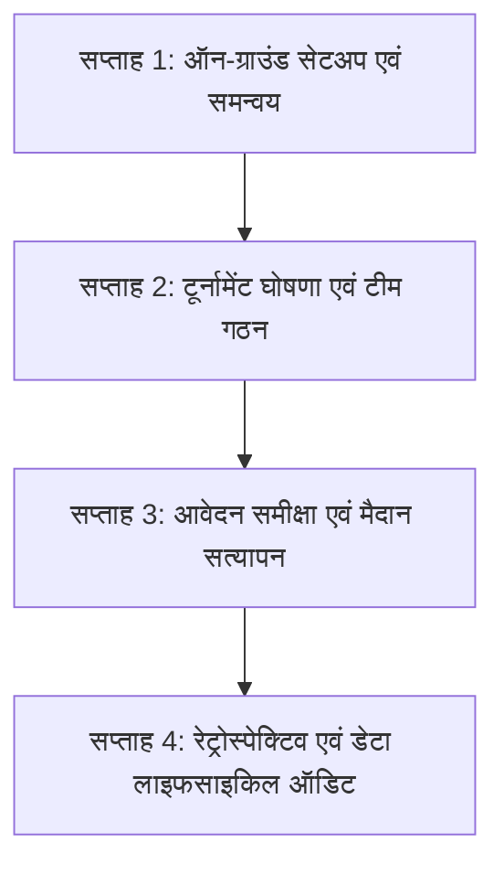

# Controlled Village Pilot Playbook: Bhadohi District

**Document Status:** Approved Baseline v1  
**Project:** Bhadohi Village Cricket Platform (`bvcp`)  
**Pilot Window:** 4 Weeks  
**Pilot Geography:** 3 Selected Clusters across Bhadohi District (Gyanpur, Aurai, Suriyawan)  
**Target Group:** Adults 18+ only  

---

## 1. Pilot Objectives & Scope

The Controlled Village Pilot is designed to evaluate real-world adoption, reliability, and community trust in the Bhadohi Village Cricket Platform prior to an unrestricted district-wide release.

### Core Hypotheses to Test:
1. **SMS-Free Authentication Viability:** Adult rural users (18+) can register, remember, and authenticate using a 6-digit PIN and securely store their paper recovery code without relying on failure-prone SMS OTP gateways.
2. **Temporary Squad Assembly Speed:** Village team captains can scout available local talent and assemble an 11–15 player squad within 48–72 hours using the Hindi discovery directory.
3. **Organizer Dashboard Efficiency:** Local tournament organizers can review applications, inspect rosters, and coordinate via WhatsApp handoff significantly faster than fragmented paper/WhatsApp group chat processes.
4. **Privacy Respect & Trust:** Players trust the platform because their phone numbers are strictly concealed until mutual squad invite acceptance.

---

## 2. Pilot Clusters & Venue Selection

Three distinct village clusters representing diverse rural demographic and network conditions across Bhadohi have been selected:

| Cluster | Block | Primary Village Ground | Target Tournaments | Participating Villages | Expected Cohort |
|---|---|---|---|---|---|
| **Cluster A** | Gyanpur | खमरिया इंटर कॉलेज मैदान (Khamaria) | 1 Open Tournament (16 teams) | खमरिया, जंगीगंज, गोपपुर, ज्ञानपुर खास | ~120 players, 8 captains, 2 organizers |
| **Cluster B** | Aurai | औराई नगर पंचायत मैदान (Aurai / Madhavsingh) | 1 Block League (8 teams) | औराई, घोसिया, माधोसिंह, मिर्जापुर बॉर्डर ग्राम | ~90 players, 6 captains, 2 organizers |
| **Cluster C** | Suriyawan | सुरियावां स्टेशन रोड मैदान (Suriyawan) | 1 Gramin Knockout (8 teams) | सुरियावां, पाली, अभोली सीमावर्ती ग्राम | ~90 players, 6 captains, 2 organizers |

---

## 3. Four-Week Phased Rollout Schedule

### सप्ताह 1: ऑन-ग्राउंड सेटअप एवं समन्वय (Days 1–7)
- Deploy staging environment and distribute Android APK / Web Dashboard URLs.
- Onboard 6 local village tournament coordinators (teachers, respected local elders, senior sports enthusiasts).
- Hand out physical laminated **Coordinator Field Kits** (Hindi quick-start guide, paper recovery code cards).
- Conduct hands-on walkthroughs for PIN registration, profile setup, and availability toggles.

### सप्ताह 2: टूर्नामेंट घोषणा एवं टीम गठन (Days 8–14)
- Organizers draft and publish 3 pilot tournaments with clear cash-on-ground notices (e.g., "₹500 प्रति टीम - मैदान पर नकद") and accept the offline payment disclaimer.
- 20+ village captains register and create temporary tournament teams.
- Captains use the scouting directory to invite available players.
- Players accept invitations, auto-populating team squad rosters and unlocking the WhatsApp coordinator handoff.

### सप्ताह 3: आवेदन समीक्षा एवं मैदान सत्यापन (Days 15–21)
- Captains submit completed squad applications (minimum 11 confirmed adult players).
- Organizers review applications in the web dashboard, verify that all squad members have verified their 18+ adult age, and accept qualified teams.
- Organizers click the one-touch WhatsApp direct link to confirm on-ground arrival times with team captains.
- Matches are conducted strictly on physical grounds under independent village umpiring.

### सप्ताह 4: रेट्रोस्पेक्टिव एवं डेटा लाइफसाइकिल ऑडिट (Days 22–28)
- Verify automated nightly background cron execution:
  - Expired 15-day player availabilities automatically switch to `isAvailable = false`.
  - Stale pending invitations automatically transition to `EXPIRED`.
- Gather coordinator feedback via structured 5-question Hindi qualitative interviews.
- Calculate quantitative pilot telemetry metrics (see Section 4).
- Prepare formal release sign-off for Phase 11 production launch.

---

## 4. Key Pilot Metrics & Success Thresholds

| Metric | Target Threshold | Measuring Method | Action If Threshold Missed |
|---|---|---|---|
| **Registration Completion** | >= 90% | Successful users who complete profile after entering mobile + PIN | Simplify UI instructions; add visual cue for recovery code recording. |
| **Account Lockout Incident Rate** | <= 5% | Total accounts triggering `ACCOUNT_LOCKED` vs total logins | Re-evaluate PIN length or increase allowed consecutive attempts from 5 to 7. |
| **Squad Formation Speed** | <= 72 hours | Time from team creation to reaching 11 confirmed squad members | Send localized push notification to players in the host block. |
| **Application Acceptance Rate** | >= 80% | Applications accepted by organizers vs submitted applications | Provide clearer eligibility criteria in tournament guidelines. |
| **PII Protection Compliance** | **100% (Zero Leaks)** | Automated log analysis checking for mobile numbers on public endpoints | Immediate security patch release; suspend affected endpoints. |
| **Zero Commercial Creep** | **100% (Zero)** | Codebase and DB scan for payment gateways, rankings, or stats | Platform policy violation; immediate code rejection. |

---

## 5. Contingency & Support Protocols

1. **Lost PIN Procedure:**
   - User navigates to "पिन भूल गए?" (Forgot PIN?).
   - Enters mobile number and paper recovery code.
   - Sets a new 6-digit PIN and receives a fresh recovery code.
   - If recovery code is also lost, the local coordinator assists via admin identity verification on-ground.
2. **Network Outage During Squad Registration:**
   - Client detects network drop and preserves form state locally.
   - Displays Hindi banner: "नेटवर्क धीमा है। आपका डेटा सुरक्षित है।"
   - Re-submits with exponential backoff once signal returns; server idempotency guards prevent duplicate teams or invites.
3. **Underage Attempt Flagging:**
   - Any report submitted with category `UNDERAGE` receives highest priority in the moderation queue.
   - Organizer/Admin verifies physical Aadhaar/voter ID on-ground and removes ineligible participants.
